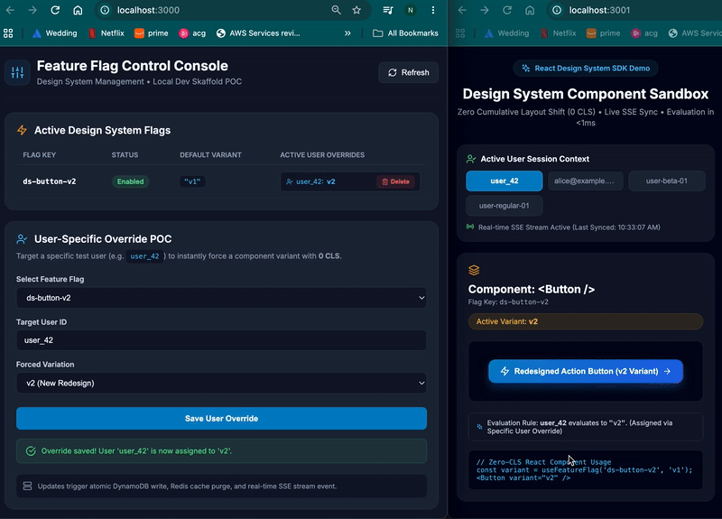

# Feature Flag Proof of Concept (POC)

An end-to-end feature flag system with low-latency evaluation, per-person user override targeting, and real-time Server-Sent Events (SSE) updates across clients.



## Key Features

- **Per-Person User Overrides**: Force specific variants for individual users (`user_42`, `user-beta-01`) instantly.
- **Real-time SSE Sync**: Live pushes from Go backend to connected frontend clients when flags or user overrides are created/updated/deleted.
- **Low-Latency Evaluation**: Sub-100ms evaluation responses with fallback defaults.
- **Custom Modals**: Integrated confirmation modals for user override deletion (no native `alert()` or `confirm()` popups).
- **Responsive Admin & Client Apps**: Dynamic UI layout scaling smoothly for desktop and mobile views.

## Architecture

- **Backend**: Go API service using Gin framework, in-memory/DynamoDB fallback ruleset, and Redis cache.
- **Admin Portal**: React control console built with Vite and Lucide icon components (`http://localhost:3000`).
- **Client App**: React app demonstrating design system button variants driven by feature flag evaluation (`http://localhost:3001`).

## API Endpoints

- `GET /api/v1/admin/flags` - Fetch list of active feature flags and user overrides.
- `POST /api/v1/admin/flags/:key/overrides/user` - Set user-specific flag override.
- `DELETE /api/v1/admin/flags/:key/overrides/users/*userId` - Delete user flag override.
- `GET /api/v1/evaluate?userId={id}` - Low-latency evaluation endpoint.
- `GET /api/v1/stream` - Real-time SSE flag updates stream.

## Local Development & Commands

```bash
# Install dependencies across Go service and React frontend apps
make install

# Start full dev stack (Go API on :8080, Admin on :3000, Client on :3001)
make dev

# Run Go backend test suite & React frontend UI unit tests
make test

# Kill processes running on local ports (8080, 3000, 3001)
make kill
```

