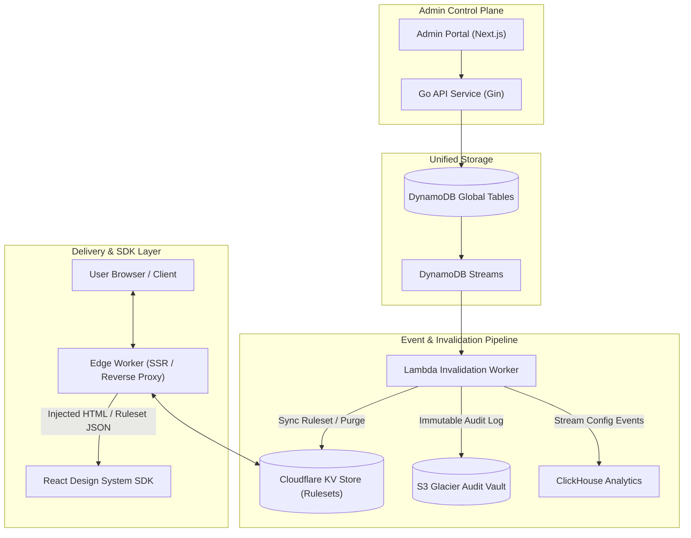
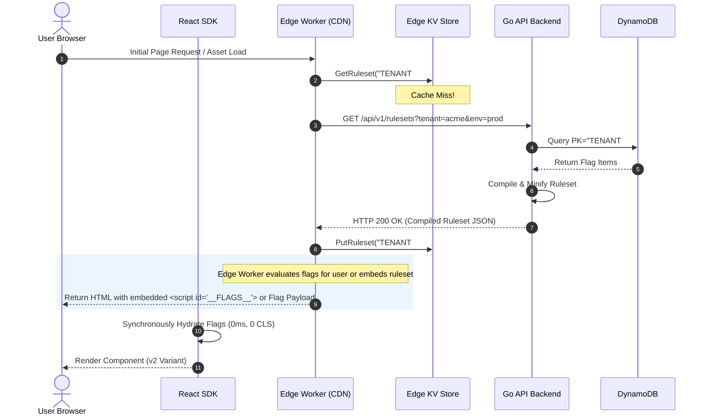
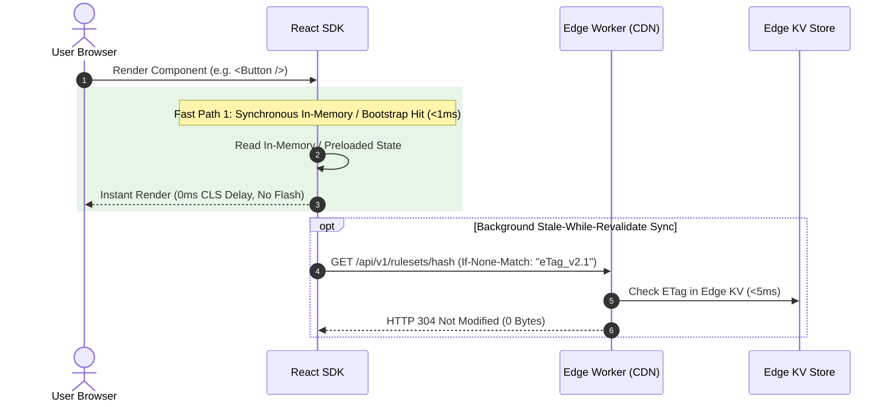
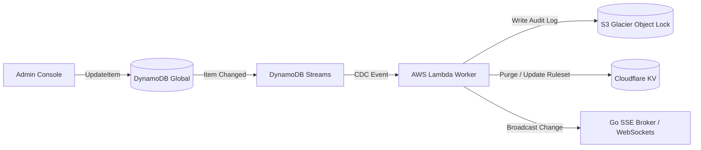
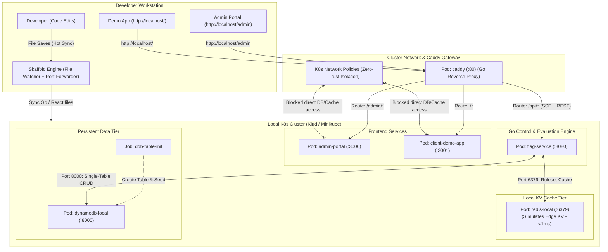
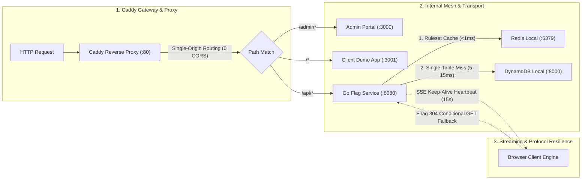
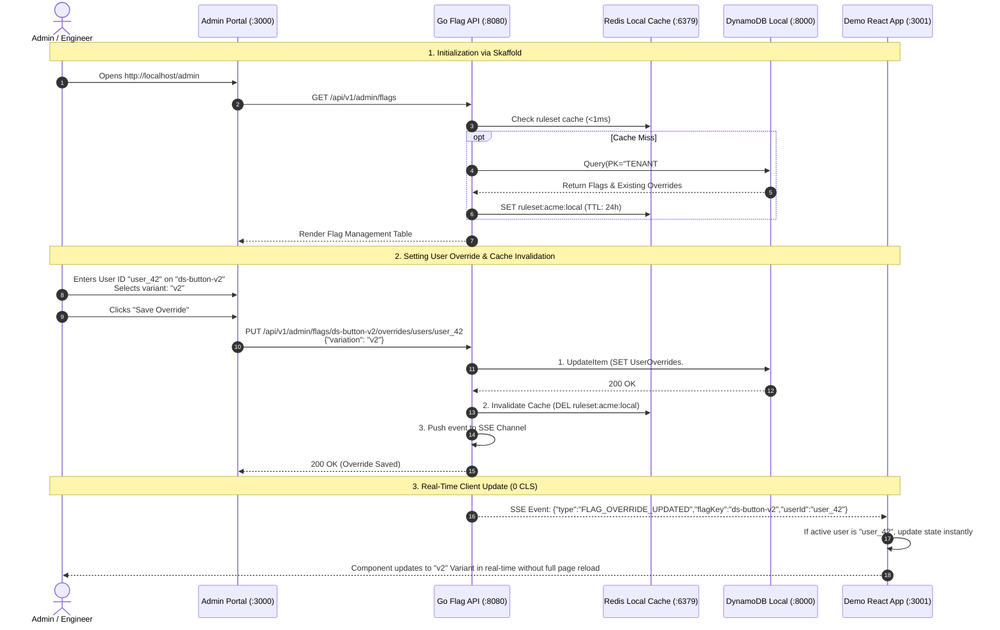

# System Design: Custom Feature Flag System for a Design System

## 1. Executive Summary & Requirements

Designing a Feature Flag system specifically tailored for a **Design System** requires solving unique challenges beyond traditional backend flags. UI feature flagging must guarantee **zero Cumulative Layout Shift (CLS)**, **sub-millisecond client-side evaluation (<1ms)**, **Server-Side Rendering (SSR) / React Server Component (RSC) compatibility**, **type-safe flag definitions**, and **deterministic component bucketing** for A/B testing and canary releases of UI components.

---

### Key Requirements

#### Functional Requirements
1. **Targeted UI Rollouts**: Toggle component variants (e.g., `"v1" | "v2" | "compact"`), themes, and entire UI modules based on user context (`userId`, `tenantId`, `role`, `country`, `device`).
2. **Deterministic Percentage Bucketing**: Consistently assign users to experiment variations across re-renders, sessions, and devices.
3. **Framework Integration**: Support React 18/19 Client Components (`useFeatureFlag` hook, `<FeatureFlag />` wrapper) and Server Components (RSC/SSR) without hydration mismatch errors.
4. **Zero Cumulative Layout Shift (0 CLS)**: Synchronous state initialization and SSR/Edge bootstrapping to eliminate layout shifts or visual flashes.
5. **Type Safety & DX**: Auto-generated TypeScript types for flag keys and multivariate values to prevent typos.
6. **Real-time Configuration Push**: Real-time push updates via SSE/Edge KV cache invalidation when flags change in the control plane.

#### Non-Functional Requirements
1. **Ultra-Low Latency (<1ms Client / <5ms Edge)**: In-memory client evaluation; rulesets cached at the Edge close to the user; zero blocking origin calls on critical render paths.
2. **High Availability (99.999%)**: Active-active multi-region storage powered by DynamoDB Global Tables and Cloudflare Edge distribution.
3. **High Cache Efficiency**: Edge KV caches *environment rulesets* (low cardinality, high cache hit ratio) rather than individual user evaluations.
4. **Governance & Stale Flag Cleanup**: Asynchronous CDC audit logging via DynamoDB Streams, automated ESLint flag deprecation alerts, and codemod cleanup pipelines.

---

## 2. System Architecture & Tech Stack



### Technology Selection Breakdown

| Component Layer | Technology Choice | Rationale |
| :--- | :--- | :--- |
| **Client SDK** | React 18/19, TypeScript 5.x, `murmurhash3` | Zero-dependency evaluation engine; in-memory evaluation with synchronous storage fallback. |
| **Edge Distribution** | Cloudflare Workers & Workers KV | Caches compiled **tenant environment rulesets** globally (<5ms). Evaluates rules for SSR or serves rules to SPA. |
| **Unified Database** | Amazon DynamoDB (Global Tables) | Active-active multi-region storage. Environment-namespaced single-table design. |
| **Audit & Invalidation CDC** | DynamoDB Streams + AWS Lambda | Asynchronously writes immutable audit logs to S3 and pushes ruleset updates to Edge KV in <1s. |
| **Backend API** | Go 1.22 (Gin framework) | High-throughput REST API for control plane and Server-Sent Events (SSE) broadcaster for real-time dev tooling. |
| **Telemetry Pipeline** | Client Batcher + Kafka + ClickHouse | Client deduplication buffer prevents event storms; ClickHouse provides sub-second experiment conversion analytics. |
| **Admin Console** | Next.js 14 + Tailwind CSS | Internal web portal for product managers and design system engineers to manage rollouts. |

---

## 3. Evaluation Strategy & Sequence Flows

### Evaluation Model: Compiled Ruleset at Edge & Client
To achieve 99.999% availability and eliminate origin bottlenecks:
* **The Edge KV does NOT cache per-user evaluation responses** (which would create $O(Users \times Flags)$ cache explosion).
* **The Edge KV caches the compiled Tenant Environment Ruleset** (`RULES#<tenantId>#<env>`), resulting in $>99.9\%$ edge cache hit rates.
* **Evaluation happens in-memory** either inside the Edge Worker (for SSR/RSC) or inside the Client SDK (for SPAs).

---

#### Scenario A: Uncached Request / Cold Start (Edge Ruleset Miss)



**Latency Benchmark:** `~60ms - 120ms` (One-time edge cold start; subsequent requests hit Edge KV in `<5ms`).

---

#### Scenario B: Cached Request / Hot Path (Edge KV Hit + Client Instant Render)



**Latency Benchmark:** `<1ms` (Synchronous Client Evaluation) / `<5ms` (Edge KV 304 validation).

---

## 4. DynamoDB Single-Table Schema & Audit Architecture

### Single-Table Data Model with Environment Isolation

To guarantee that staging or canary changes cannot mutate production flags, each partition key (`PK`) isolates both **Tenant** and **Environment**.

| Partition Key (`PK`) | Sort Key (`SK`) | Attributes / Item Value |
| :--- | :--- | :--- |
| `TENANT#acme#ENV#production` | `FLAG#ds-button-v2` | `{ "key": "ds-button-v2", "enabled": true, "defaultValue": "v1", "targetingRules": [...], "rollout": [...], "updatedAt": 1757750400 }` |
| `TENANT#acme#ENV#production` | `FLAG#ds-theme-mode` | `{ "key": "ds-theme-mode", "enabled": true, "defaultValue": "light", "targetingRules": [...], "updatedAt": 1757750400 }` |
| `TENANT#acme#ENV#production` | `METADATA` | `{ "envName": "production", "version": "v1.4.2", "rulesetHash": "a8f3b4c" }` |
| `TENANT#acme#ENV#staging` | `FLAG#ds-button-v2` | `{ "key": "ds-button-v2", "enabled": true, "defaultValue": "v2", ... }` |

#### Access Patterns Supported:
1. **Fetch Entire Ruleset for Environment**: 
   `Query(PK = "TENANT#acme#ENV#production" AND begins_with(SK, "FLAG#"))`
   *Executes in a single roundtrip to DynamoDB.*
2. **Update Single Flag**:
   `UpdateItem(PK = "TENANT#acme#ENV#production", SK = "FLAG#ds-button-v2")`

---

### Asynchronous Audit Log & Invalidation Pipeline

DynamoDB Streams provides an asynchronous Change Data Capture (CDC) pipeline. Control plane flag updates never block on S3 writes or multi-region cache invalidation.



---

## 5. Deterministic Bucketing & Evaluation Engine

To prevent layout shifts and flicker, a user must deterministically receive the identical variation across sessions and devices.

### Fixed Logic Implementation

1. **Unsigned 32-bit Hash modulo**: Corrects JavaScript's negative modulo behavior via `>>> 0`.
2. **Multivariate Targeting**: Supports string/numeric variations (e.g. `"v2"`, `"compact"`, `false`) rather than hardcoding boolean `true`.

```typescript
import murmurhash from 'murmurhash';

export interface RolloutVariation {
  variation: string | boolean | number;
  bucketPercentage: number; // Sum of variations should equal 100
}

export interface TargetingRule {
  attribute: string;
  values: string[];
  variation: string | boolean | number;
}

export interface FeatureFlagConfig {
  key: string;
  enabled: boolean;
  defaultValue: string | boolean | number;
  targetingRules?: TargetingRule[];
  rollout?: RolloutVariation[];
}

/**
 * Calculates a deterministic percentage (0-99) for a user and flag key.
 * Guarantees unsigned 32-bit integer arithmetic.
 */
export function calculateBucket(userId: string, flagKey: string): number {
  const hash = murmurhash.v3(`${userId}:${flagKey}`) >>> 0;
  return hash % 100;
}

/**
 * Evaluates flag value for a given user context in <0.01ms.
 */
export function evaluateFlag(
  flag: FeatureFlagConfig,
  context: { userId: string; [key: string]: any }
): string | boolean | number {
  if (!flag.enabled) return flag.defaultValue;

  // 1. Explicit Targeting Rules
  if (flag.targetingRules && flag.targetingRules.length > 0) {
    for (const rule of flag.targetingRules) {
      const userAttr = context[rule.attribute];
      if (userAttr !== undefined && rule.values.includes(String(userAttr))) {
        return rule.variation; // Correctly returns specific variant
      }
    }
  }

  // 2. Percentage Rollout Bucketing
  if (flag.rollout && flag.rollout.length > 0) {
    const bucket = calculateBucket(context.userId, flag.key);
    let cumulative = 0;
    for (const item of flag.rollout) {
      cumulative += item.bucketPercentage;
      if (bucket < cumulative) {
        return item.variation;
      }
    }
  }

  return flag.defaultValue;
}
```

---

## 6. Design System React SDK Integration

### A. Zero-CLS Context Provider (Synchronous Hydration + SSR Support)

To guarantee **0 CLS**, flags must be populated **synchronously during initialization**, before the first DOM paint. Reading flags asynchronously in `useEffect` is strictly forbidden.

```tsx
import React, { createContext, useContext, useState, useEffect, useMemo, useCallback } from 'react';

interface FlagContextType {
  getFlag: <T = any>(key: string, fallback: T) => T;
  isLoading: boolean;
}

const FlagContext = createContext<FlagContextType>({
  getFlag: (_, fallback) => fallback,
  isLoading: false,
});

const STORAGE_KEY = 'ds_feature_flags';

function getInitialFlags(initialFlags?: Record<string, any>): Record<string, any> {
  // 1. SSR / Bootstrap Script precedence
  if (initialFlags && Object.keys(initialFlags).length > 0) {
    return initialFlags;
  }
  // 2. Browser Window Global (injected via Edge/SSR <script id="__FLAGS__">)
  if (typeof window !== 'undefined' && (window as any).__INITIAL_FLAGS__) {
    return (window as any).__INITIAL_FLAGS__;
  }
  // 3. Synchronous LocalStorage Read (runs BEFORE first paint)
  if (typeof window !== 'undefined') {
    try {
      const cached = localStorage.getItem(STORAGE_KEY);
      if (cached) return JSON.parse(cached);
    } catch {
      // Ignore private browsing / quota errors
    }
  }
  return {};
}

export const FeatureFlagProvider: React.FC<{
  flagsUrl: string;
  userContext: { userId: string; [key: string]: any };
  initialFlags?: Record<string, any>;
  children: React.ReactNode;
}> = ({ flagsUrl, userContext, initialFlags, children }) => {
  // Synchronous state initialization prevents layout shift & visual flicker
  const [flags, setFlags] = useState<Record<string, any>>(() => getInitialFlags(initialFlags));
  const [isLoading, setIsLoading] = useState(false);

  // Background revalidation (Stale-While-Revalidate)
  useEffect(() => {
    let isMounted = true;
    
    fetch(flagsUrl)
      .then((res) => res.json())
      .then((rules: FeatureFlagConfig[]) => {
        if (!isMounted) return;
        const evaluated: Record<string, any> = {};
        for (const rule of rules) {
          evaluated[rule.key] = evaluateFlag(rule, userContext);
        }
        setFlags(evaluated);
        try {
          localStorage.setItem(STORAGE_KEY, JSON.stringify(evaluated));
        } catch {}
      })
      .catch((err) => console.warn('Feature flags SWR sync error:', err));

    return () => {
      isMounted = false;
    };
  }, [flagsUrl, userContext.userId]);

  // Stable callback avoids re-rendering memoized Design System components
  const getFlag = useCallback(
    <T,>(key: string, fallback: T): T => {
      return flags[key] !== undefined ? (flags[key] as T) : fallback;
    },
    [flags]
  );

  const contextValue = useMemo(() => ({ getFlag, isLoading }), [getFlag, isLoading]);

  return <FlagContext.Provider value={contextValue}>{children}</FlagContext.Provider>;
};
```

---

### B. Custom Hook & Declarative Component Wrapper

```tsx
// 1. Custom Type-Safe Hook
export function useFeatureFlag<T = boolean>(flagKey: string, fallback: T): T {
  const { getFlag } = useContext(FlagContext);
  return getFlag<T>(flagKey, fallback);
}

// 2. Declarative Component Wrapper with Skeleton Fallback
interface FeatureFlagProps {
  flag: string;
  fallback?: React.ReactNode;
  children: React.ReactNode;
}

export const FeatureFlag: React.FC<FeatureFlagProps> = ({
  flag,
  fallback = null,
  children,
}) => {
  const isEnabled = useFeatureFlag(flag, false);
  return <>{isEnabled ? children : fallback}</>;
};
```

---

### C. Server Components (RSC) & SSR Integration

For Next.js App Router or Remix, flags are evaluated at the Edge or Server before rendering begins:

```tsx
// app/layout.tsx (React Server Component)
import { evaluateFlag } from '@/lib/feature-flags';
import { getCompiledRuleset } from '@/lib/edge-kv';
import { FeatureFlagProvider } from '@your-ds/react-sdk';

export default async function RootLayout({ children }: { children: React.ReactNode }) {
  const user = await getCurrentUser();
  const rules = await getCompiledRuleset('acme', process.env.NODE_ENV);
  
  // Evaluate in-memory on server
  const evaluatedFlags: Record<string, any> = {};
  for (const rule of rules) {
    evaluatedFlags[rule.key] = evaluateFlag(rule, user);
  }

  return (
    <html lang="en">
      <head>
        {/* Injects flags for instant client hydration */}
        <script
          id="__FLAGS__"
          dangerouslySetInnerHTML={{
            __html: `window.__INITIAL_FLAGS__ = ${JSON.stringify(evaluatedFlags)};`,
          }}
        />
      </head>
      <body>
        <FeatureFlagProvider
          flagsUrl="/api/v1/ruleset"
          userContext={user}
          initialFlags={evaluatedFlags}
        >
          {children}
        </FeatureFlagProvider>
      </body>
    </html>
  );
}
```

---

## 7. Governance, Telemetry & Code Cleanup

### A. Deduplicated & Batched Telemetry Engine

To prevent **event storms** when a page renders dozens of flagged UI components (buttons, badges, inputs), the SDK deduplicates evaluations per pageview and flushes events in batches.

```typescript
class FlagAnalyticsBatcher {
  private evaluated = new Set<string>();
  private buffer: Array<{ flagKey: string; variation: any; timestamp: number }> = [];
  private timer: any = null;

  public trackEvaluation(flagKey: string, variation: any, userId: string) {
    const dedupKey = `${flagKey}:${variation}`;
    if (this.evaluated.has(dedupKey)) {
      return; // Already logged this session/pageview
    }
    this.evaluated.add(dedupKey);

    this.buffer.push({ flagKey, variation, timestamp: Date.now() });

    if (!this.timer) {
      this.timer = setTimeout(() => this.flush(userId), 5000);
    }
  }

  private flush(userId: string) {
    if (this.buffer.length === 0) return;
    const payload = JSON.stringify({ userId, events: this.buffer });
    this.buffer = [];
    this.timer = null;

    if (typeof navigator !== 'undefined' && navigator.sendBeacon) {
      navigator.sendBeacon('/api/v1/telemetry/flags', payload);
    } else {
      fetch('/api/v1/telemetry/flags', { method: 'POST', body: payload, keepalive: true }).catch(() => {});
    }
  }
}

export const flagAnalytics = new FlagAnalyticsBatcher();
```

---

### B. Flag Deprecation & Automated PR Cleanup

1. **Custom ESLint Rule (`@your-ds/no-stale-feature-flag`)**:
   Inspects flag definitions against an active manifest API during CI. Throws warnings for flags active $>90$ days.
2. **Automated Codemods (jscodeshift)**:
   When a flag reaches 100% rollout in production for 30 consecutive days, a GitHub Action creates an automated Pull Request stripping `<FeatureFlag>` conditionals and retaining the winning variation.

---

## 8. Principal Architecture Summary

| Design Metric | Architectural Strategy | Concrete Benefit |
| :--- | :--- | :--- |
| **Unified Storage** | DynamoDB Global Tables (`TENANT#...#ENV#...`) | Complete environment isolation; sub-second active-active replication globally. |
| **0 CLS Guarantee** | Synchronous `useState` + SSR/Edge `<script>` bootstrap | Zero visual flicker or layout shifts; eliminates post-paint `useEffect` flashes. |
| **Edge Cache Hit Ratio** | Cache compiled ruleset at Edge KV, not per-user responses | $>99.9\%$ edge hit rate; avoids combinatorial cache explosion in Cloudflare KV. |
| **Evaluation Speed** | In-Memory MurmurHash3 (`>>> 0`) | Sub-millisecond evaluation (<0.01ms); 100% deterministic across user devices. |
| **Audit Compliance** | DynamoDB Streams CDC to S3 Glacier Object Lock | Immutable audit logs without adding a single millisecond to control-plane writes. |
| **Telemetry Protection** | Client-side evaluation deduplication + batch flushing | Protects browser UI thread and downstream Kafka/ClickHouse pipelines from event storms. |
| **Code Health** | ESLint linting + automated jscodeshift codemods | Prevents dead flag branching from accumulating technical debt across the design system. |

---

## 9. Local Development Environment & Skaffold POC Implementation

To enable rapid iteration without cloud dependencies, the local development environment is orchestrated via **Skaffold** targeting a local Kubernetes cluster (**Minikube**, **Kind**, or **Docker Desktop**). 

The local POC provides:
1. **Caddy Reverse Proxy Gateway**: Zero-dependency Go gateway providing single-origin routing (`:80`) and unbuffered SSE push streaming.
2. **Local Redis Cache Pod**: Runs `redis:7.2-alpine` in-cluster, simulating the low-latency Cloudflare Edge KV ruleset cache (<1ms).
3. **Local DynamoDB**: Runs `amazon/dynamodb-local` with an auto-provisioning table init job.
4. **Go Flag API Service**: High-performance REST + SSE engine with live file-sync, hot-reloading, and two-tier caching.
5. **Admin Web Portal**: UI allowing engineers and product owners to inspect flags and **set user-level overrides** in real-time.
6. **Client Demo Application**: React Design System showcase showing real-time component variant transitions with zero layout shift.

---

### A. Local Architecture & Skaffold Topology



---

### B. Skaffold Configuration (`skaffold.yaml`)

This configuration configures file syncing for sub-second rebuild times, automatic port forwarding, and profile-based overrides.

```yaml
apiVersion: skaffold/v4beta9
kind: Config
metadata:
  name: feature-flag-poc
build:
  artifacts:
    # 1. Go Flag Service (Optimized for quick recompilation or file sync)
    - image: flag-service
      context: services/flag-service
      docker:
        dockerfile: Dockerfile.dev
      sync:
        infer:
          - '**/*.go'
          - 'config/*.yaml'

    # 2. Admin Portal (Next.js / Vite SPA)
    - image: admin-portal
      context: apps/admin-portal
      docker:
        dockerfile: Dockerfile.dev
      sync:
        manual:
          - src: 'src/**/*.tsx'
            dest: '/app'
          - src: 'src/**/*.ts'
            dest: '/app'
          - src: 'src/**/*.css'
            dest: '/app'

    # 3. Client Demo Application
    - image: client-demo-app
      context: apps/client-demo-app
      docker:
        dockerfile: Dockerfile.dev
      sync:
        manual:
          - src: 'src/**/*'
            dest: '/app'

manifests:
  rawYaml:
    - k8s/local/network-policy.yaml
    - k8s/local/caddy.yaml
    - k8s/local/redis.yaml
    - k8s/local/dynamodb.yaml
    - k8s/local/flag-service.yaml
    - k8s/local/admin-portal.yaml
    - k8s/local/client-demo-app.yaml

portForward:
  - resourceType: Service
    resourceName: caddy
    port: 80
    localPort: 80
  - resourceType: Service
    resourceName: flag-service
    port: 8080
    localPort: 8080
  - resourceType: Service
    resourceName: redis-local
    port: 6379
    localPort: 6379
  - resourceType: Service
    resourceName: admin-portal
    port: 3000
    localPort: 3000
  - resourceType: Service
    resourceName: client-demo-app
    port: 3001
    localPort: 3001
  - resourceType: Service
    resourceName: dynamodb-local
    port: 8000
    localPort: 8000

profiles:
  - name: debug
    patches:
      - op: add
        path: /build/artifacts/0/docker/buildArgs
        value:
          ENABLE_DELVE: "true"
```

---

### C. Local Kubernetes Manifests

#### 1. Caddy Gateway & Reverse Proxy (`k8s/local/caddy.yaml`)

Deploys **Caddy** (written in Go) as a lightweight, zero-dependency reverse proxy. It eliminates the need to install a heavy Kubernetes Ingress Controller addon, natively supports unbuffered Server-Sent Events (SSE), and consolidates all services under a single origin.

```yaml
apiVersion: v1
kind: ConfigMap
metadata:
  name: caddy-config
data:
  Caddyfile: |
    :80 {
        # Global reverse proxy settings
        log {
            output stdout
            format console
        }

        # Real-time SSE stream & REST API
        handle /api/* {
            reverse_proxy flag-service:8080 {
                # Immediate flush ensures SSE events stream without buffer delay
                flush_interval -1
            }
        }

        # Admin Control Console
        handle_path /admin* {
            reverse_proxy admin-portal:3000
        }

        # Client Demo Application (Default route)
        handle {
            reverse_proxy client-demo-app:3001
        }
    }
---
apiVersion: apps/v1
kind: Deployment
metadata:
  name: caddy
spec:
  replicas: 1
  selector:
    matchLabels:
      app: caddy
  template:
    metadata:
      labels:
        app: caddy
    spec:
      containers:
        - name: caddy
          image: caddy:2.7.6-alpine
          ports:
            - containerPort: 80
          volumeMounts:
            - name: config-volume
              mountPath: /etc/caddy/Caddyfile
              subPath: Caddyfile
      volumes:
        - name: config-volume
          configMap:
            name: caddy-config
---
apiVersion: v1
kind: Service
metadata:
  name: caddy
spec:
  ports:
    - port: 80
      targetPort: 80
  selector:
    app: caddy
```

#### 2. Zero-Trust Network Policy (`k8s/local/network-policy.yaml`)

Restricts database and cache access so that only `flag-service` pods can communicate with `dynamodb-local` and `redis-local`.

```yaml
apiVersion: networking.k8s.io/v1
kind: NetworkPolicy
metadata:
  name: backend-isolation-policy
spec:
  podSelector:
    matchExpressions:
      - key: app
        operator: In
        values: ["dynamodb-local", "redis-local"]
  policyTypes:
    - Ingress
  ingress:
    # Only allow traffic originating from flag-service pods
    - from:
        - podSelector:
            matchLabels:
              app: flag-service
      ports:
        - protocol: TCP
          port: 8000 # DynamoDB
        - protocol: TCP
          port: 6379 # Redis
```

#### 3. Redis Local Cache Pod (`k8s/local/redis.yaml`)

Runs a lightweight **Redis 7.2** pod inside the cluster to simulate the edge KV caching layer (<1ms).

```yaml
apiVersion: apps/v1
kind: Deployment
metadata:
  name: redis-local
  labels:
    app: redis-local
spec:
  replicas: 1
  selector:
    matchLabels:
      app: redis-local
  template:
    metadata:
      labels:
        app: redis-local
    spec:
      containers:
        - name: redis
          image: redis:7.2-alpine
          # In-memory LRU cache capped at 64MB
          args: ["--maxmemory", "64mb", "--maxmemory-policy", "allkeys-lru"]
          ports:
            - containerPort: 6379
          resources:
            requests:
              cpu: 50m
              memory: 32Mi
            limits:
              cpu: 200m
              memory: 128Mi
---
apiVersion: v1
kind: Service
metadata:
  name: redis-local
spec:
  ports:
    - port: 6379
      targetPort: 6379
  selector:
    app: redis-local
```

#### 4. DynamoDB Local & Auto-Init (`k8s/local/dynamodb.yaml`)

```yaml
apiVersion: apps/v1
kind: Deployment
metadata:
  name: dynamodb-local
spec:
  replicas: 1
  selector:
    matchLabels:
      app: dynamodb-local
  template:
    metadata:
      labels:
        app: dynamodb-local
    spec:
      containers:
        - name: dynamodb-local
          image: amazon/dynamodb-local:2.5.2
          args: ["-jar", "DynamoDBLocal.jar", "-sharedDb", "-inMemory"]
          ports:
            - containerPort: 8000
---
apiVersion: v1
kind: Service
metadata:
  name: dynamodb-local
spec:
  ports:
    - port: 8000
      targetPort: 8000
  selector:
    app: dynamodb-local
---
apiVersion: batch/v1
kind: Job
metadata:
  name: ddb-table-init
spec:
  backoffLimit: 3
  template:
    spec:
      restartPolicy: OnFailure
      containers:
        - name: aws-cli-init
          image: amazon/aws-cli:2.15.15
          env:
            - name: AWS_ACCESS_KEY_ID
              value: "fakeKeyId"
            - name: AWS_SECRET_ACCESS_KEY
              value: "fakeSecretAccessKey"
            - name: AWS_DEFAULT_REGION
              value: "us-east-1"
          command: ["/bin/sh", "-c"]
          args:
            - |
              echo "Waiting for DynamoDB Local..."
              until curl -s http://dynamodb-local:8000; do sleep 1; done;
              echo "Creating FeatureFlags single table..."
              aws dynamodb create-table \
                --endpoint-url http://dynamodb-local:8000 \
                --table-name FeatureFlags \
                --attribute-definitions \
                  AttributeName=PK,AttributeType=S \
                  AttributeName=SK,AttributeType=S \
                --key-schema \
                  AttributeName=PK,KeyType=HASH \
                  AttributeName=SK,KeyType=RANGE \
                --billing-mode PAY_PER_REQUEST || true
              echo "Table created successfully."
```

#### 5. Flag Service Manifest (`k8s/local/flag-service.yaml`)

```yaml
apiVersion: apps/v1
kind: Deployment
metadata:
  name: flag-service
spec:
  replicas: 1
  selector:
    matchLabels:
      app: flag-service
  template:
    metadata:
      labels:
        app: flag-service
    spec:
      containers:
        - name: flag-service
          image: flag-service
          ports:
            - containerPort: 8080
          env:
            - name: ENV
              value: "local"
            - name: PORT
              value: "8080"
            - name: REDIS_ADDR
              value: "redis-local:6379"
            - name: DYNAMODB_ENDPOINT
              value: "http://dynamodb-local:8000"
            - name: AWS_REGION
              value: "us-east-1"
            - name: AWS_ACCESS_KEY_ID
              value: "dummy"
            - name: AWS_SECRET_ACCESS_KEY
              value: "dummy"
---
apiVersion: v1
kind: Service
metadata:
  name: flag-service
spec:
  ports:
    - port: 8080
      targetPort: 8080
  selector:
    app: flag-service
```

---

### D. Network Layer Architecture & Traffic Routing

A resilient feature flag system relies on three distinct network boundaries: **Caddy Gateway / Reverse Proxy**, **Internal Cluster DNS & Zero-Trust Mesh**, and **HTTP Transport / Streaming Resilience**.



#### 1. Caddy Gateway & Single-Origin Routing
* **Zero Kubernetes Addon Overhead**: Unlike NGINX Ingress which requires installing cluster-level ingress controllers and custom CRDs, Caddy runs as a lightweight, standard Go-based container managed directly by Skaffold on any Minikube, Kind, or Docker Desktop cluster.
* **Native Zero-Buffer Streaming**: Caddy does not buffer chunked transfer encodings by default. By setting `flush_interval -1` in the `Caddyfile`, Server-Sent Events (SSE) from `flag-service:8080` flush immediately to browser subscribers with sub-millisecond propagation.
* **Unified Origin (0 CORS)**: Exposing `/api`, `/admin`, and `/` under `http://localhost:80` (or `http://flags.local`) eliminates CORS preflight roundtrips (`OPTIONS`) from the critical rendering path while mirroring production reverse-proxy setups.

#### 2. Kubernetes CoreDNS & Zero-Trust Isolation
* **Service Discovery**: Services resolve via Kubernetes CoreDNS using standard internal endpoints (`http://flag-service.default.svc.cluster.local:8080`, `redis-local.default.svc.cluster.local:6379`, and `http://dynamodb-local.default.svc.cluster.local:8000`).
* **NetworkPolicy Boundaries**: Even in local development, frontend pods (`admin-portal` and `client-demo-app`) are barred from opening TCP connections to DynamoDB Local or Redis Local via explicit `NetworkPolicy` rules. All mutations and evaluations must pass through the Go control plane.

#### 3. Local Distributed Cache Tier (Redis Pod)
* **Simulating Edge KV**: In production, compiled rulesets are cached at Cloudflare Edge KV. In the local Skaffold environment, `redis-local` acts as this shared KV store, providing `<1ms` response times for flag reads.
* **Cache-Aside Pattern**:
  1. `GET /api/v1/ruleset`: Checks Redis key `ruleset:acme:local`. On hit, returns immediately.
  2. On cache miss: Queries DynamoDB Local, compiles ruleset, writes to Redis with 24h TTL, and returns.
* **Write Invalidation**: When an admin updates a flag or override via `PUT /api/v1/admin/flags/...`, the service updates DynamoDB, immediately executes `DEL ruleset:acme:local`, and broadcasts an SSE cache-invalidation event.

#### 4. Go Server Network Layer & Transport Hardening
* **Anti-Slowloris Timeouts**: The Go server is configured using an explicit `http.Server` struct rather than `gin.Run()` to avoid connection leaks:
  * `ReadHeaderTimeout: 2 * time.Second` (mitigates slowloris DOS)
  * `ReadTimeout: 5 * time.Second`
  * `WriteTimeout: 10 * time.Second` (extended for SSE handlers)
  * `IdleTimeout: 120 * time.Second`
* **AWS SDK Transport Connection Pooling**: Outbound calls to DynamoDB utilize an optimized `http.Transport`:
  ```go
  customTransport := &http.Transport{
      MaxIdleConns:        100,
      MaxIdleConnsPerHost: 20,
      IdleConnTimeout:     90 * time.Second,
      KeepAlive:           30 * time.Second,
  }
  ```
* **Graceful Shutdown**: The network listener traps `SIGINT`/`SIGTERM` and drains active connections with a 10-second timeout context via `server.Shutdown(ctx)`.

#### 5. Real-Time Streaming (SSE) Network Protocol & Fallback
* **Keep-Alive Heartbeats**: To prevent intermediate proxies or firewalls from severing idle TCP connections, the Go server transmits an SSE comment ping (`:keepalive\n\n`) every 15 seconds.
* **Client Reconnection with Jitter**: If the network connection drops, the client SDK uses exponential backoff with randomized jitter (`min: 1s, max: 30s`) to avoid reconnect storms.
* **HTTP 304 Conditional GET Fallback**: If SSE streams are blocked by strict corporate firewalls, the SDK falls back to lightweight polling using `If-None-Match: <hash>`. The server returns `304 Not Modified` with zero payload body when no flags have mutated.

---

### E. Golang Ecosystem: Packages & Test Libraries

The backend is built in Go 1.22 for minimal memory footprint and raw throughput. The following curated packages and testing frameworks form the foundation:

| Category | Package | Version | Purpose & Architectural Role |
| :--- | :--- | :--- | :--- |
| **HTTP Routing & API** | `github.com/gin-gonic/gin` | `v1.9.1` | High-performance routing, JSON middleware, and Server-Sent Events (`c.Stream()`) support. |
| **Network & CORS** | `github.com/gin-contrib/cors` | `v1.7.0` | Cross-Origin Resource Sharing middleware for permissive local dev and strict prod policies. |
| **Distributed Cache** | `github.com/redis/go-redis/v9` | `v9.5.1` | Official Redis client providing connection pooling, cluster support, and fail-open caching. |
| **AWS SDK v2 (DynamoDB)** | `github.com/aws/aws-sdk-go-v2` | `v1.26.0` | Official AWS SDK with custom endpoint resolver targeting `dynamodb-local:8000`. |
| **DynamoDB Client** | `github.com/aws/aws-sdk-go-v2/service/dynamodb` | `v1.31.0` | Low-level PutItem, Query, and UpdateItem drivers. |
| **DynamoDB Marshalling** | `github.com/aws/aws-sdk-go-v2/feature/dynamodb/attributevalue` | `v1.13.11` | Automatic struct-to-AttributeValue marshaling and unmarshaling. |
| **Hashing Parity** | `github.com/spaolacci/murmur3` | `v1.1.0` | 32-bit MurmurHash3 algorithm providing **100% exact parity** with the TypeScript SDK (`murmurhash.v3`). |
| **Configuration** | `github.com/spf13/viper` | `v1.18.2` | 12-factor application config loaded from environment variables and yaml fallback. |
| **Validation** | `github.com/go-playground/validator/v10` | `v10.19.0` | Validates rollout percentages (sum to 100), key formats, and user context payloads. |
| **Testing Suite & Assertions** | `github.com/stretchr/testify` | `v1.9.0` | Rich assertion primitives (`assert`, `require`), suite lifecycles (`suite.Suite`), and mock drivers. |
| **Containerized Integration Tests**| `github.com/testcontainers/testcontainers-go` | `v0.29.1` | Programmatically provisions ephemeral `amazon/dynamodb-local` and `redis:7.2-alpine` containers in automated CI test runs. |
| **HTTP Testing** | `net/http/httptest` | *Stdlib* | Mocking client/server HTTP exchanges without spinning up external listening ports. |

---

### F. Go Implementation: Domain Model, Evaluation Engine & User Overrides

#### 1. Domain Entities & Storage Models (`internal/domain/flag.go`)

```go
package domain

// VariationValue represents a typed multivariate or boolean value
type VariationValue any

// TargetingRule defines an attribute-matching rule
type TargetingRule struct {
	Attribute string         `json:"attribute" dynamodbav:"attribute"`
	Values    []string       `json:"values" dynamodbav:"values"`
	Variation VariationValue `json:"variation" dynamodbav:"variation"`
}

// RolloutVariation defines bucket percentages
type RolloutVariation struct {
	Variation        VariationValue `json:"variation" dynamodbav:"variation"`
	BucketPercentage int            `json:"bucketPercentage" dynamodbav:"bucketPercentage"`
}

// FeatureFlag is the core configuration entity stored in DynamoDB
type FeatureFlag struct {
	Key            string                    `json:"key" dynamodbav:"Key"`
	Enabled        bool                      `json:"enabled" dynamodbav:"Enabled"`
	DefaultValue   VariationValue            `json:"defaultValue" dynamodbav:"DefaultValue"`
	UserOverrides  map[string]VariationValue `json:"userOverrides,omitempty" dynamodbav:"UserOverrides,omitempty"`
	TargetingRules []TargetingRule           `json:"targetingRules,omitempty" dynamodbav:"TargetingRules,omitempty"`
	Rollout        []RolloutVariation        `json:"rollout,omitempty" dynamodbav:"Rollout,omitempty"`
	UpdatedAt      int64                     `json:"updatedAt" dynamodbav:"UpdatedAt"`
}

// EvaluationContext encapsulates incoming request identifiers
type EvaluationContext struct {
	UserID     string            `json:"userId"`
	TenantID   string            `json:"tenantId"`
	Attributes map[string]string `json:"attributes"`
}
```

#### 2. Evaluation Engine with Exact Murmur3 Parity (`internal/evaluator/engine.go`)

```go
package evaluator

import (
	"fmt"

	"github.com/spaolacci/murmur3"
	"flag-service/internal/domain"
)

// CalculateBucket generates a deterministic 0-99 bucket matching the React/TypeScript SDK
func CalculateBucket(userID string, flagKey string) int {
	seed := fmt.Sprintf("%s:%s", userID, flagKey)
	hash := murmur3.Sum32([]byte(seed))
	return int(hash % 100)
}

// Evaluate determines the active variation for a given user context
func Evaluate(flag domain.FeatureFlag, ctx domain.EvaluationContext) domain.VariationValue {
	if !flag.Enabled {
		return flag.DefaultValue
	}

	// 1. Explicit User-Specific Overrides (Highest Priority for Admin POC)
	if flag.UserOverrides != nil {
		if overrideVal, exists := flag.UserOverrides[ctx.UserID]; exists {
			return overrideVal
		}
	}

	// 2. Targeting Rules (Attribute Matching)
	for _, rule := range flag.TargetingRules {
		if val, exists := ctx.Attributes[rule.Attribute]; exists {
			for _, targetVal := range rule.Values {
				if val == targetVal {
					return rule.Variation
				}
			}
		}
	}

	// 3. Percentage Rollout Bucketing
	if len(flag.Rollout) > 0 {
		bucket := CalculateBucket(ctx.UserID, flag.Key)
		cumulative := 0
		for _, variant := range flag.Rollout {
			cumulative += variant.BucketPercentage
			if bucket < cumulative {
				return variant.Variation
			}
		}
	}

	return flag.DefaultValue
}
```

#### 3. Ruleset Cache Layer (`internal/cache/ruleset_cache.go`)

```go
package cache

import (
	"context"
	"encoding/json"
	"fmt"
	"time"

	"github.com/redis/go-redis/v9"
	"flag-service/internal/domain"
)

type CachedRuleset struct {
	ETag  string               `json:"etag"`
	Flags []domain.FeatureFlag `json:"flags"`
}

type RulesetCache struct {
	rdb *redis.Client
}

func NewRulesetCache(redisAddr string) *RulesetCache {
	rdb := redis.NewClient(&redis.Options{
		Addr:         redisAddr, // "redis-local:6379"
		DialTimeout:  2 * time.Second,
		ReadTimeout:  1 * time.Second,
		WriteTimeout: 1 * time.Second,
		PoolSize:     20,
	})
	return &RulesetCache{rdb: rdb}
}

// GetRuleset returns cached rules and ETag (<1ms)
func (c *RulesetCache) GetRuleset(ctx context.Context, tenant, env string) ([]domain.FeatureFlag, string, error) {
	key := fmt.Sprintf("ruleset:%s:%s", tenant, env)
	val, err := c.rdb.Get(ctx, key).Result()
	if err == redis.Nil {
		return nil, "", nil // Cache Miss
	} else if err != nil {
		return nil, "", err // Redis fail-open to DB
	}

	var cached CachedRuleset
	if err := json.Unmarshal([]byte(val), &cached); err != nil {
		return nil, "", err
	}
	return cached.Flags, cached.ETag, nil
}

// SetRuleset populates Redis with compiled flags and computed ETag
func (c *RulesetCache) SetRuleset(ctx context.Context, tenant, env string, flags []domain.FeatureFlag, etag string) error {
	key := fmt.Sprintf("ruleset:%s:%s", tenant, env)
	payload, err := json.Marshal(CachedRuleset{ETag: etag, Flags: flags})
	if err != nil {
		return err
	}
	return c.rdb.Set(ctx, key, payload, 24*time.Hour).Err()
}

// Invalidate purges cache when an admin mutates a flag or override
func (c *RulesetCache) Invalidate(ctx context.Context, tenant, env string) error {
	key := fmt.Sprintf("ruleset:%s:%s", tenant, env)
	return c.rdb.Del(ctx, key).Err()
}
```

#### 4. Admin User Override Handlers & SSE Live Reload (`internal/api/handlers.go`)

```go
package api

import (
	"context"
	"fmt"
	"io"
	"net/http"
	"time"

	"github.com/aws/aws-sdk-go-v2/aws"
	"github.com/aws/aws-sdk-go-v2/feature/dynamodb/attributevalue"
	"github.com/aws/aws-sdk-go-v2/service/dynamodb"
	"github.com/aws/aws-sdk-go-v2/service/dynamodb/types"
	"github.com/gin-gonic/gin"

	"flag-service/internal/cache"
	"flag-service/internal/domain"
)

type FlagHandler struct {
	ddbClient *dynamodb.Client
	tableName string
	cache     *cache.RulesetCache
	sseChan   chan string // Channel to push real-time updates to connected browsers
}

func NewFlagHandler(client *dynamodb.Client, table string, cache *cache.RulesetCache) *FlagHandler {
	return &FlagHandler{
		ddbClient: client,
		tableName: table,
		cache:     cache,
		sseChan:   make(chan string, 100),
	}
}

type SetOverrideRequest struct {
	Variation any `json:"variation" binding:"required"`
}

// SetUserOverride updates a flag's specific user override in DynamoDB and invalidates Redis
// PUT /api/v1/admin/flags/:key/overrides/users/:userId
func (handler *FlagHandler) SetUserOverride(ginContext *gin.Context) {
	flagKey := ginContext.Param("key")
	userID := ginContext.Param("userId")

	var requestBody SetOverrideRequest
	if err := ginContext.ShouldBindJSON(&requestBody); err != nil {
		ginContext.JSON(http.StatusBadRequest, gin.H{"error": err.Error()})
		return
	}

	partitionKey := "TENANT#acme#ENV#local"
	sortKey := fmt.Sprintf("FLAG#%s", flagKey)

	valueAttributeValue, err := attributevalue.Marshal(requestBody.Variation)
	if err != nil {
		ginContext.JSON(http.StatusInternalServerError, gin.H{"error": "serialization error"})
		return
	}

	// 1. Atomically set map key in DynamoDB
	_, err = handler.ddbClient.UpdateItem(context.TODO(), &dynamodb.UpdateItemInput{
		TableName: aws.String(handler.tableName),
		Key: map[string]types.AttributeValue{
			"PK": &types.AttributeValueMemberS{Value: partitionKey},
			"SK": &types.AttributeValueMemberS{Value: sortKey},
		},
		UpdateExpression: aws.String("SET UserOverrides.#uid = :val, UpdatedAt = :now"),
		ExpressionAttributeNames: map[string]string{
			"#uid": userID,
		},
		ExpressionAttributeValues: map[string]types.AttributeValue{
			":val": valueAttributeValue,
			":now": &types.AttributeValueMemberN{Value: fmt.Sprintf("%d", time.Now().Unix())},
		},
	})

	if err != nil {
		ginContext.JSON(http.StatusInternalServerError, gin.H{"error": err.Error()})
		return
	}

	// 2. Invalidate local Redis cache so subsequent reads fetch fresh rules
	_ = handler.cache.Invalidate(ginContext.Request.Context(), "acme", "local")

	// 3. Broadcast invalidation event over SSE to connected clients
	eventMessage := fmt.Sprintf(`{"type":"FLAG_OVERRIDE_UPDATED","flagKey":"%s","userId":"%s"}`, flagKey, userID)
	handler.broadcastSSE(eventMessage)

	ginContext.JSON(http.StatusOK, gin.H{
		"status":    "success",
		"flagKey":   flagKey,
		"userId":    userID,
		"variation": requestBody.Variation,
	})
}

// SSEStream pushes live flag change events to connected browsers for instant zero-refresh updates
// GET /api/v1/stream
func (h *FlagHandler) SSEStream(c *gin.Context) {
	c.Writer.Header().Set("Content-Type", "text/event-stream")
	c.Writer.Header().Set("Cache-Control", "no-cache")
	c.Writer.Header().Set("Connection", "keep-alive")

	c.Stream(func(w io.Writer) bool {
		msg, ok := <-h.sseChan
		if !ok {
			return false
		}
		c.SSEvent("message", msg)
		return true
	})
}
```

---

### G. Golang Test Suite: Unit & Integration Testing

#### 1. Evaluation Parity Unit Test with `testify/assert` (`internal/evaluator/engine_test.go`)

Verifies that Go `CalculateBucket` produces identical outputs to the JavaScript/TypeScript SDK for known vector seeds.

```go
package evaluator_test

import (
	"testing"

	"github.com/stretchr/testify/assert"
	"flag-service/internal/domain"
	"flag-service/internal/evaluator"
)

func TestEvaluation_ParityAndOverrides(t *testing.T) {
	flag := domain.FeatureFlag{
		Key:          "ds-button-v2",
		Enabled:      true,
		DefaultValue: "v1",
		UserOverrides: map[string]domain.VariationValue{
			"user-admin-99": "v2",
			"user-beta-01":  "compact",
		},
		Rollout: []domain.RolloutVariation{
			{Variation: "v1", BucketPercentage: 50},
			{Variation: "v2", BucketPercentage: 50},
		},
	}

	t.Run("Explicit user override takes precedence", func(t *testing.T) {
		ctx := domain.EvaluationContext{UserID: "user-admin-99"}
		result := evaluator.Evaluate(flag, ctx)
		assert.Equal(t, "v2", result)
	})

	t.Run("Non-overridden user falls through to deterministic rollout", func(t *testing.T) {
		ctx := domain.EvaluationContext{UserID: "user-regular-01"}
		bucket := evaluator.CalculateBucket(ctx.UserID, flag.Key)
		result := evaluator.Evaluate(flag, ctx)

		if bucket < 50 {
			assert.Equal(t, "v1", result)
		} else {
			assert.Equal(t, "v2", result)
		}
	})

	t.Run("Disabled flag returns default value unconditionally", func(t *testing.T) {
		disabledFlag := flag
		disabledFlag.Enabled = false
		ctx := domain.EvaluationContext{UserID: "user-admin-99"} // Even with override
		assert.Equal(t, "v1", evaluator.Evaluate(disabledFlag, ctx))
	})
}
```

#### 2. Integration Test with `testcontainers-go` and DynamoDB Local (`test/integration/dynamodb_test.go`)

Runs a real containerized DynamoDB instance to test Single-Table queries and atomic override updates.

```go
package integration_test

import (
	"context"
	"testing"

	"github.com/aws/aws-sdk-go-v2/aws"
	"github.com/aws/aws-sdk-go-v2/config"
	"github.com/aws/aws-sdk-go-v2/credentials"
	"github.com/aws/aws-sdk-go-v2/service/dynamodb"
	"github.com/aws/aws-sdk-go-v2/service/dynamodb/types"
	"github.com/stretchr/testify/require"
	"github.com/stretchr/testify/suite"
	"github.com/testcontainers/testcontainers-go"
	"github.com/testcontainers/testcontainers-go/wait"
)

type DynamoDBIntegrationTestSuite struct {
	suite.Suite
	ctx       context.Context
	container testcontainers.Container
	client    *dynamodb.Client
	tableName string
}

func (s *DynamoDBIntegrationTestSuite) SetupSuite() {
	s.ctx = context.Background()
	s.tableName = "FeatureFlagsTest"

	req := testcontainers.ContainerRequest{
		Image:        "amazon/dynamodb-local:2.5.2",
		ExposedPorts: []string{"8000/tcp"},
		WaitingFor:   wait.ForHTTP("/").WithPort("8000/tcp"),
	}

	container, err := testcontainers.GenericContainer(s.ctx, testcontainers.GenericContainerRequest{
		ContainerRequest: req,
		Started:          true,
	})
	s.Require().NoError(err)
	s.container = container

	endpoint, err := container.PortEndpoint(s.ctx, "8000/tcp", "http")
	s.Require().NoError(err)

	cfg, err := config.LoadDefaultConfig(s.ctx,
		config.WithRegion("us-east-1"),
		config.WithEndpointResolverWithOptions(aws.EndpointResolverWithOptionsFunc(
			func(service, region string, options ...interface{}) (aws.Endpoint, error) {
				return aws.Endpoint{URL: endpoint}, nil
			},
		)),
		config.WithCredentialsProvider(credentials.NewStaticCredentialsProvider("dummy", "dummy", "")),
	)
	s.Require().NoError(err)
	s.client = dynamodb.NewFromConfig(cfg)

	// Create test table
	_, err = s.client.CreateTable(s.ctx, &dynamodb.CreateTableInput{
		TableName: aws.String(s.tableName),
		AttributeDefinitions: []types.AttributeDefinition{
			{AttributeName: aws.String("PK"), AttributeType: types.ScalarAttributeTypeS},
			{AttributeName: aws.String("SK"), AttributeType: types.ScalarAttributeTypeS},
		},
		KeySchema: []types.KeySchemaElement{
			{AttributeName: aws.String("PK"), KeyType: types.KeyTypeHash},
			{AttributeName: aws.String("SK"), KeyType: types.KeyTypeRange},
		},
		BillingMode: types.BillingModePayPerRequest,
	})
	s.Require().NoError(err)
}

func (s *DynamoDBIntegrationTestSuite) TearDownSuite() {
	if s.container != nil {
		_ = s.container.Terminate(s.ctx)
	}
}

func (s *DynamoDBIntegrationTestSuite) TestSetAndGetOverride() {
	pk := "TENANT#acme#ENV#test"
	sk := "FLAG#ds-button-v2"

	// Put flag
	_, err := s.client.PutItem(s.ctx, &dynamodb.PutItemInput{
		TableName: aws.String(s.tableName),
		Item: map[string]types.AttributeValue{
			"PK":      &types.AttributeValueMemberS{Value: pk},
			"SK":      &types.AttributeValueMemberS{Value: sk},
			"Key":     &types.AttributeValueMemberS{Value: "ds-button-v2"},
			"Enabled": &types.AttributeValueMemberBOOL{Value: true},
		},
	})
	s.Require().NoError(err)

	// Verify getItem
	res, err := s.client.GetItem(s.ctx, &dynamodb.GetItemInput{
		TableName: aws.String(s.tableName),
		Key: map[string]types.AttributeValue{
			"PK": &types.AttributeValueMemberS{Value: pk},
			"SK": &types.AttributeValueMemberS{Value: sk},
		},
	})
	s.Require().NoError(err)
	s.Equal("ds-button-v2", res.Item["Key"].(*types.AttributeValueMemberS).Value)
}

func TestDynamoDBSuite(t *testing.T) {
	suite.Run(t, new(DynamoDBIntegrationTestSuite))
}
```

---

### H. Admin POC Flow: Real-Time User Override Walkthrough

The following step-by-step flow describes how an engineer or product owner uses the local POC to override flags for a specific test user:



#### Developer Quickstart Commands

```bash
# 1. Start the entire stack in Skaffold with live auto-sync and port forwarding
skaffold dev --port-forward

# 2. Run unit & parity tests
go test -v ./internal/evaluator/...

# 3. Run integration tests against DynamoDB Local & Redis Testcontainers
go test -v ./test/integration/...

# 4. Inspect or flush Redis cache live from host:
redis-cli -p 6379 ping
redis-cli -p 6379 keys "*"
redis-cli -p 6379 get "ruleset:acme:local"

# 5. Endpoints available locally:
# Caddy Gateway (Single-Origin): http://localhost:80 (or http://flags.local)
#   - Admin Portal:      http://localhost/admin (or localhost:3000)
#   - Demo React App:    http://localhost/      (or localhost:3001)
#   - Flag API & SSE:    http://localhost/api   (or localhost:8080)
# Redis Local Cache:     localhost:6379
# DynamoDB Local:        http://localhost:8000
```

